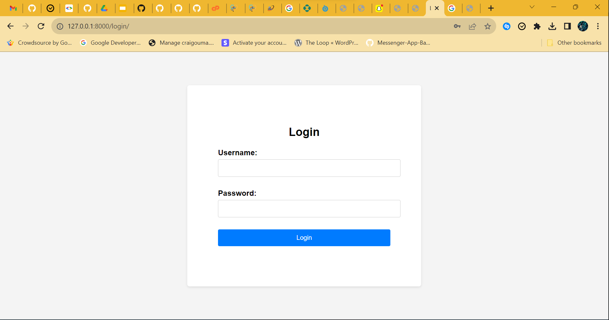
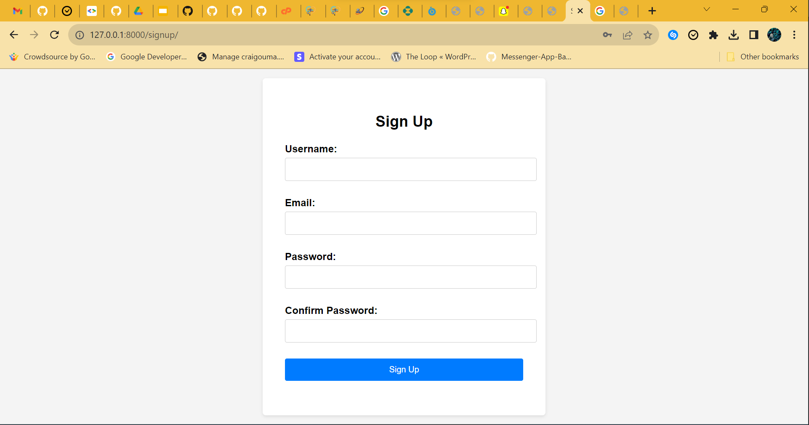
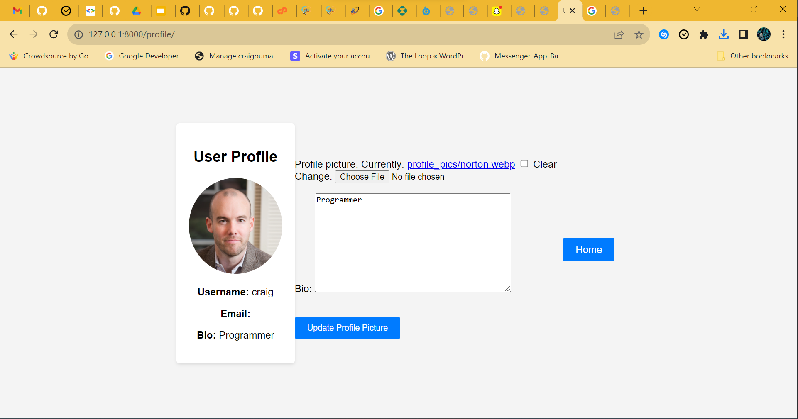
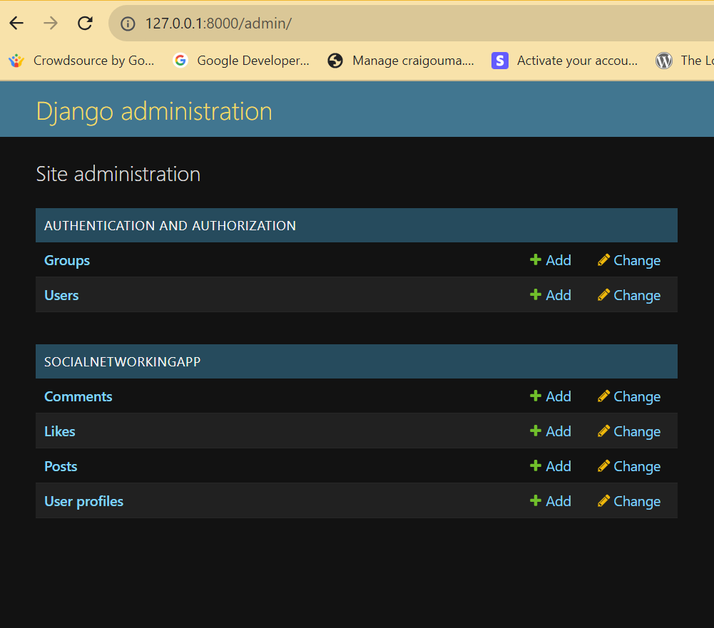
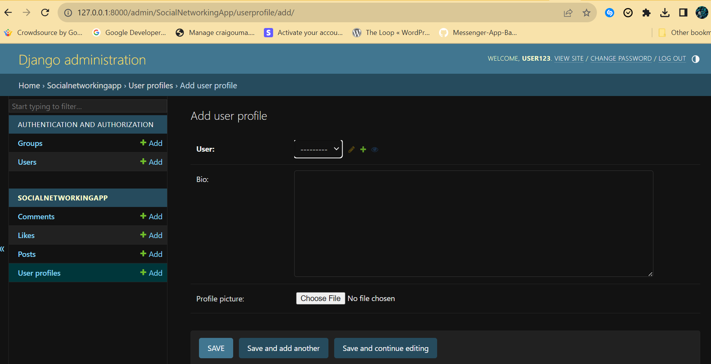
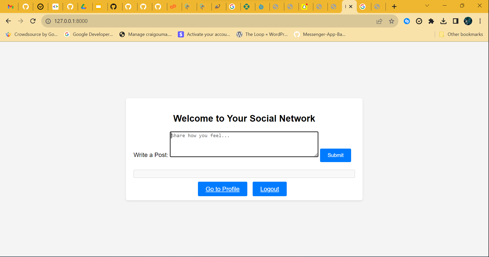

# Social Networking Web App-Django

  

**The Project has four pages**

-To display the homepage use: [http://127.0.0.1:8000/](http://127.0.0.1:8000/)

-To display the login page use: [http://127.0.0.1:8000/login/](http://127.0.0.1:8000/login/)

-To display the signup page use: [http://127.0.0.1:8000/signup/](http://127.0.0.1:8000/signup/)

# Running the Code on a Virtual Environment

1. **Open the Codespace Terminal:**

   In your Codespace, open the integrated terminal from the "Terminal" menu.

2. **Create a Virtual Environment:(Can be skipped to step 3)**

   ```bash
   python -m venv venv
   ```

3. **Activate the Virtual Environment:**

   For Windows:
   ```bash
   .\venv\Scripts\activate
   ```
   For macOS and Linux:
   ```bash
   source venv/bin/activate
   ```

4. **Install Project Dependencies:**

   Navigate to your Django project directory, then:
   ```bash
   pip install -r requirements.txt
   ```

5. **Database Setup:**

   If your Django project uses a database:
   ```bash
   python manage.py makemigrations
   python manage.py migrate
   ```

6. **Run the Django Development Server:**

   ```bash
   python manage.py runserver
   ```
7. **LogIn Page**

    

8. **SignUp Page**

    

9. **Profile Page**

    

10. **Django Admin Page**

    
    

11. **Home Page**

    
